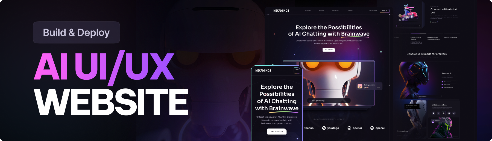

   
      
   

  

    
    
    
  

  <h3 align="center">Modern UI/UX website</h3>

   

     This project design is taken from JsMastery
    

## 📋 <a name="table">Table of Contents</a>

1. 🤖 [Introduction](#introduction)
2. ⚙️ [Tech Stack](#tech-stack)
3. 🔋 [Features](#features)

## <a name="introduction">🤖 Introduction</a>

NexaMind is a cutting-edge UI/UX website created with React.js and Tailwind CSS, showcasing contemporary design principles. Its stylish appearance, smooth animations, and exceptional user experience establish a benchmark, offering a source of inspiration for future modern applications and websites.

## <a name="tech-stack">⚙️ Tech Stack</a>

- Vite
- React.js
- Tailwind CSS

## <a name="features">🔋 Features</a>

👉 **Beautiful Sections**: Features hero, services, features, how-to-use, roadmap, pricing, footer, and header.

👉 **Parallax Animations**: Provides engaging effects activated by mouse movement and scrolling.

👉 **Complex UI Geometry**: Leverages Tailwind CSS to create intricate shapes like circular feature displays, grid lines, and side lines.

👉 **Latest UI Trends**: Incorporates contemporary design elements such as bento grids.

👉 **Cool Gradients**: Uses Tailwind CSS to apply stylish gradients to cards, buttons, and more.

👉 **Responsive**: Ensures seamless functionality and aesthetics on all devices.

And much more, including code architecture and reusability.

### Website Design

The design is taken from
<a href = "https://ui8.net/ui8/products/brainwave-ai-landing-page-kit?rel=jsm"> brainwave</a>

<h5>Big Credit Goes to JsMastery</h5>
